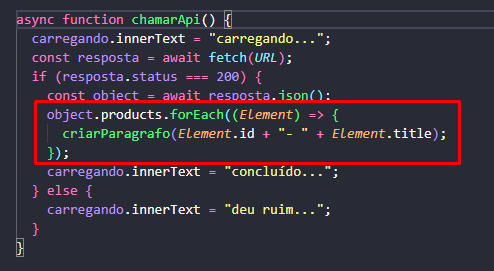

# Explicação

No presente código tem um botão que se você clicar ele vai buscar na API da DummyJSON 30 produtos.
O total são apenas 30.

Usei JS com getElementeById para pegar os ID de cada campo no HTML e retornar o nome de cada produto em cada campo.

Para gerar tudo de uma vez e não ter que fazer tudo na mão, usei essa lógica dentro da função:

_Usei essa API apenas para treinamento_
